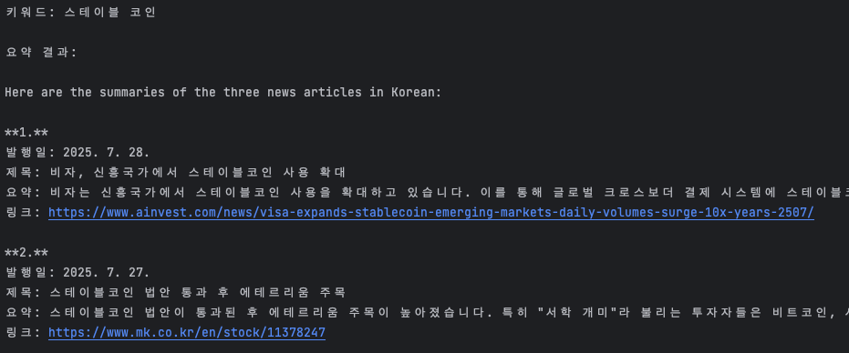
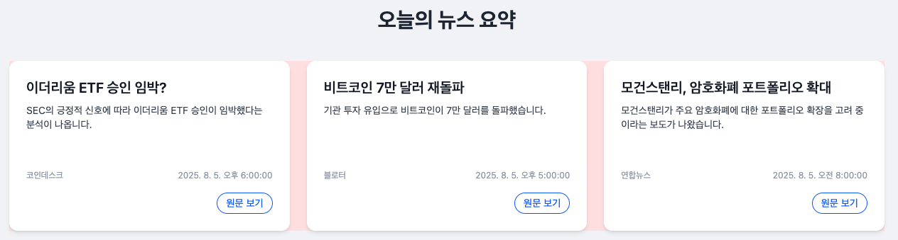

[In progress...]
- daily schedule briefing app
  - google calender
  - news on topics of interest
  - ...

# 📦 Packages Overview
- langchain + tavily(search api)
- node 18.17.1 (only support esm langchain)
- node 18 version is the most stable version for running esm

## Prerequisites
```bash
  npm install -g pnpm
```
```bash
  pnpm install
```

## news-cli
- search news and summary
### run server
```bash
npm run cli   
```

## news-frontend
- news summary frontend
### run server
```bash
npm run frontend   
```

# how to add npm packages?
```bash
pnpm add packageName --filter news-cli
```


### [Summary Test Image]
25.07.31 - langchain test


25.08.05 - frontend ui test

